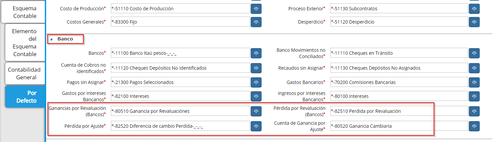
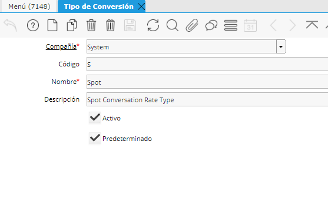

.. |Ventana Moneda| image:: resources/currency-window-usd.png
.. |Pestaña Por Defecto 1| image:: resources/accounting-preferences-for-general-transactions.png

.. |Ventana Moneda Pestaña Contabilidad 1| image:: resources/accounting-tab-in-the-currency-window.png

.. _document/setting-coins:

Configurando Monedas
====================

La conversión de moneda es efectuada cuando alguna transacción se específica en una moneda diferente a la moneda base.

Definición de Monedas
---------------------

El sistema tiene definidas las monedas más importantes del mundo. Si usted necesita adicionar otras monedas, seleccione "**Moneda**" desde el "**Menú Principal**" e introduzca la información de esta moneda.

De entrada al "**Código ISO**", el símbolo de la moneda y una descripción. Puede encontrarse información del código ISO en:

http://www.unece.org/cefact/rec/rec09en.htm.

También puede definir una cuasi moneda si lo requiere.

Precisión Decimal
-----------------

Introduzca un redondeo estándar para definir el número de lugares decimales que los importes serán redondeados para transacciones contables y documentos. Introduzca "**Redondeo del Costo**" para definir el número de lugares decimales que los importes serán redondeados cuando se ejecuten cálculos de costo.

    |Ventana Moneda|

    Imagen 1. Ventana Moneda 

Seleccione la pestaña "**Contabilidad**" si desea definir cuentas específicas de ganancias realizadas y no realizadas.

Preferencias de cuentas contables de Pérdidas y Ganancias por conversión de monedas
-----------------------------------------------------------------------------------

Las pérdidas o ganancias por conversión de monedas ocurren cuando hay una fluctuación de la tasa entre la fecha de contratación y la fecha de pago de una transacción. De manera predeterminada, todas las ganancias y pérdidas referentes a diferencias por conversión, son registradas en las cuentas de pérdidas y ganancias definidas en el "**Nivel Esquema Contable**".

Preferencias contables para transacciones generales
---------------------------------------------------

Seleccione la ventana de "**Esquema Contable**", luego seleccione la pestaña "**Cuentas por Defecto**".

Seleccione la combinación de cuentas deseadas para la "**Cuenta Ganancias Realizadas**", "**Ganancias No Realizadas**", "**Pérdidas Realizadas**", "**Pérdidas No Realizadas**".

    |Pestaña Por Defecto 1| 

    Imagen 2. Pestaña por Defecto

Preferencias contables para transacciones monetarias
----------------------------------------------------

Para las cuentas monetarias seleccione las cuentas predeterminadas en Banco.

    |Pestaña Por Defecto 2| 

    Imagen 3. Pestaña por Defecto

Hay algunas ocasiones sin embargo, que puede asignar cuentas únicas para una moneda o monedas. Si este es el caso puede definir cuentas especiales en la pestaña de "**Contabilidad**" en la ventana "**Moneda**".

    |Ventana Moneda Pestaña Contabilidad 1|

    Imagen 4. Ventana Moneda Pestaña Contabilidad

Pestaña Tasa de Cambio
----------------------

Seleccione un "**Tipo de Tasa de Cambio de SPOT**", "**Promedio**", "**Compañía**", "**Fija**", "**Fin de Período**", "**Tipo de Usuario**", "**Tasa Manual**", etc. Introduzca una fecha "**Válido Desde**". Usted no necesita introducir una fecha válido hasta, puesto que la fecha válida desde "anterior" llegará a ser in-efectiva tan pronto como una nueva fecha desde sea introducida. La fecha más reciente siempre toma precedencia sobre la fecha anterior.

Determinación de la Tasa de Conversión
--------------------------------------

Cuando se desarrolla la conversión de moneda, la tasa usada se determina de la manera siguiente:

Primero el sistema busca la tasa de cambio para el tipo definido (Spot es el predeterminado para documentos), para la moneda de la transacción y el reporte o  moneda contable.

Después busca tasas para la organización específica. Si hay una con un rango de fechas válido, entonces usa esa tasa. Si hay más de una con un rango de fechas válido entonces usa la más actual (con base en la fecha válido desde).

Si no hay tasas válidas definidas para la Organización, entonces busca tasas válidas para el cliente específico. Si hay una con un rango de fechas válido, entonces se usa esa tasa. Si hay más de una con un rango de fechas válido entonces usa la más actual (con base en la fecha válido desde).

Si no hay tasas válidas definidas para la compañía, entonces busca tasas válidas para el sistema. Si hay una con un rango de fechas válido, entonces se usa esa tasa. Si hay más de una con un rango de fechas válido entonces usa la más actual (con base en la fecha válido desde).

::

    Primero el sistema busca la tasa de cambio para el tipo definido (SPOT es el predeterminado para documentos), para la moneda de la transacción y el reporte o  moneda contable.

-

::

    Muchos tipos de moneda están definidos en ADempiere. Si es necesario, usted puede adicionar otras para su uso propio.

Los tipos de moneda pueden ser introducidos usando la ventana "**Tipo de Conversión**".

Introduzca una clave de búsqueda y nombre para este tipo de tasa.

Si lo desea introduzca una descripción.

Seleccione el cuadro de verificación activo para indicar que este tipo de moneda esta activa

Seleccione el cuadro de verificación predeterminado para indicar que este tipo de moneda deberá de ser la predeterminada.

    |Ventana Tipo de Conversión 1|

    Imagen 5. Ventana Tipo de Conversión

Como se mencionó anteriormente, la lista de precios determinará la moneda a ser usada en un documento (Orden de Ventas, Orden de compra o Factura). Cuando se selecciona un socio del negocio y su lista de precios está en una moneda diferente a la moneda contable, o usted selecciona una lista de precios que está en una moneda diferente a la moneda contable, la ventana del documento desplegará el campo "**Tipo Tasa de Conversión**" para que usted seleccione el tipo de tasa a usar para la conversión.

Cuando se aplica el documento cualquier transacción contable generada será convertida a su moneda contable con base en la fecha de contabilización del documento. Para más información acerca de las "**Tasas de Conversión de Moneda**" usadas, por favor refiérase a las secciones previas de este capítulo.