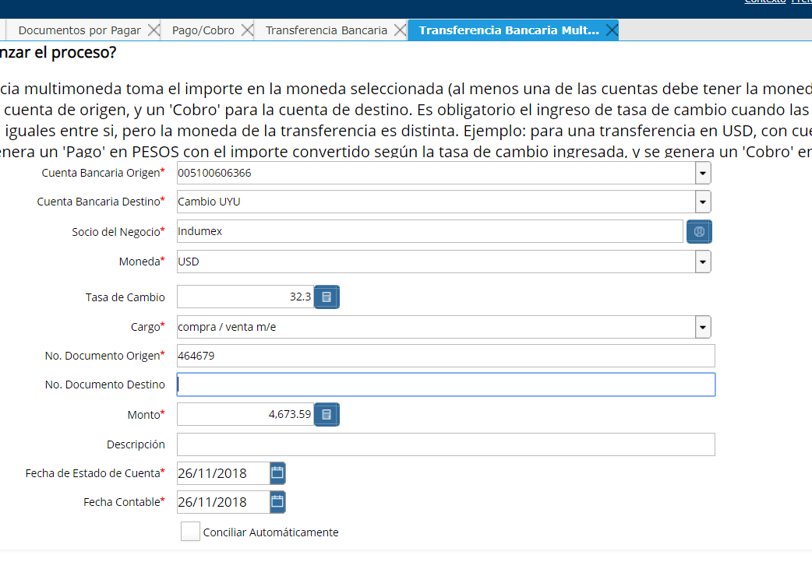
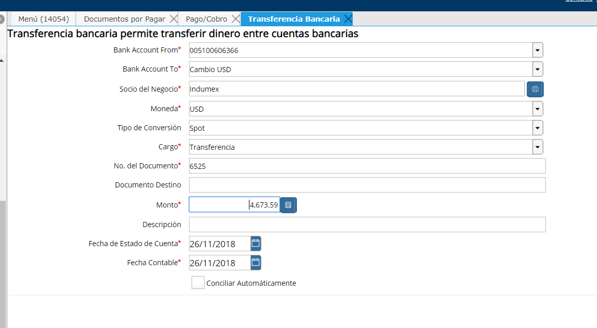
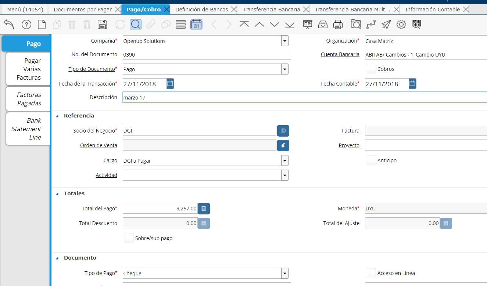
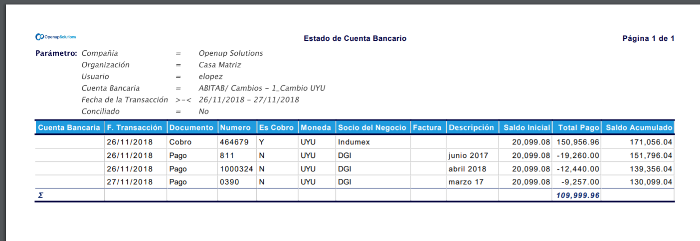

.. |Ventana Transferencia Bancaria 1| image:: resources/multi-currency-bank-transfer-window.png

.. _document/transfer-operation-exchange-currency:

**Transferencia y Operación de Cambio de Moneda**
=================================================

**Transferencia en diferente moneda a la moneda del esquema**
-------------------------------------------------------------

Aquí verá como realizar una transferencia cuando las monedas de origen y destino son diferentes, es decir una moneda es la moneda base y la otra es una moneda extranjera.

Ejemplo: Suponga que requiere realizar una transferencia entre dos cuentas propias del mismo banco de diferente moneda, el monto transferido desde la cuenta USD es "**USD 1.000**" y recibira la cuenta de moneda local UYU "**$ 30.000**".

Desde la ventana de Transferencia Bancaria Multimoneda

    |Ventana Transferencia Bancaria 1|

    Imagen 1. Ventana Transferencia Bancaria

La transferencia realiza un "**Pago**" de la cuenta bancaria "**Origen**" y un "**Cobro**" de la cuenta bancaria "**Destino**".

Esta operación debitará la cuenta bancaria USD y acreditará la cuenta bancaria en la moneda base.

::

    La elección del cargo &quot;Transferencia&quot;, determinará los asientos contables de compra y venta utilizando la cuenta puente &quot;Diferencia Compra ME&quot;. La diferencia de cambio correspondiente a esta operación quedará como saldo en dicha cuenta.

**Operación de Cambio de Moneda**
---------------------------------

Para ello se utilizará la ventana transferencia bancaria multimoneda

Es donde se realiza la operación de cambio.

    |Ventana Transferencia Bancaria 2|

    Imagen 2. Ventana Transferencia Bancaria

Aquí el cargo utilizado deberá ser "**Compra/Venta M/E**" y éste cargo determinará los asientos contables a realizar.

También se puede utilizar esta funcionalidad para:

#. Operaciones de cambio de moneda en un "**Banco / Casa Bancaria**".

#. Operaciones de pago de varios documentos de "**Misma Moneda Red de Cobranza**".

#. Operaciones de pago de varios documentos de "**Diferente Moneda Red de Cobranza**".

**Operaciones de pago de múltiples documentos de misma Moneda con Red de Cobranza**
-----------------------------------------------------------------------------------

Si las operaciones son con una misma moneda, es decir no hay cambio de moneda:

- Crear Casa Bancaria o Red de Pagos como Cuenta Bancaria

- El pago se registra como una transferencia común desde la cuenta bancaria "**Pagadora**" a la cuenta bancaria "**Red de Pagos**".

    |Ventana Transferencia Bancaria 3|

    Imagen 3. Ventana Transferencia Bancaria

Pago de facturas con el "**Casa de Cambios/**" cuenta bancaria "**Cambio/UYU**"

    |Ventana Pago Cobro 1|

    Imagen 4. Ventana Pago / Cobro 

Verificamos la transacción con reporte de "**Estado de Cuenta Bancaria**"

    |Estado de Cuenta Bancario 1|

    Imagen 5. Estado de Cuenta Bancario

Si existe entrega de dinero por parte de la "**Red de Cobranza**" se realiza transferencia de la "**Red de Cobranza**" como emisor a la cuenta bancaria receptora.