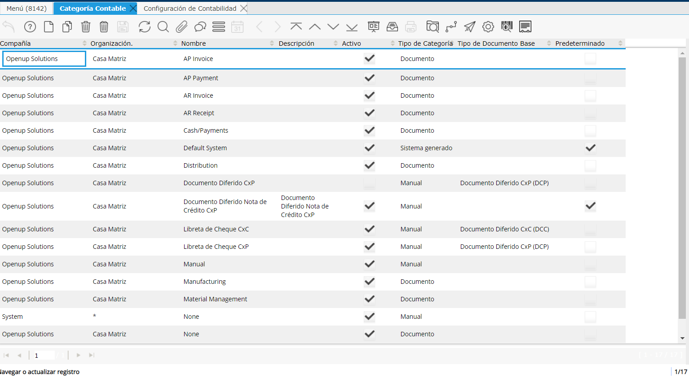

.. _document/accounting-category:

**Categoría Contable**
======================

Una categoría contable puede asociarse con un tipo de documento y el valor se usará en cada entrada de un comprobante que se genere para ese tipo de documento.

|Relacionar|

Imagen 1. Relacionar

**Definición de Cuentas Contables.**
------------------------------------

La categoría contable es una "Dimensión Contable", es decir un dato que se guarda en cada asiento contable. Por lo tanto, se pueden crear reportes utilizando la categoría contable. En práctica, la categoría contable sirve para agrupar asientos contables para utilizarlas en reportes. No tiene otra utilización.

La catergoría contable se utiliza para ordenar los asientos contables. Normalmente, se definen las siguientes categorías contables: compras, ventas, ingresos, egresos. Eso depende de los requerimientos de cada país.

