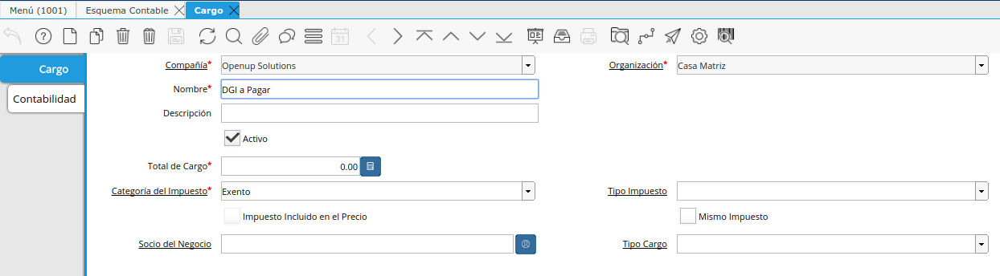
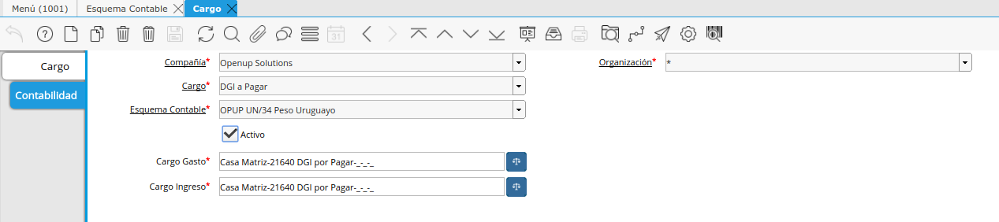

.. _document/charges:

Cargo
=====

Define los diferentes cargos adicionales en que se puede incurrir en una transacción. Se utiliza cargos para procesar transacciones directamente a una cuenta contable predeterminada.

Son mas comunes asociados a gastos, pero pueden asociarse a gastos o ingresos.

En el caso de gastos, pueden incluir cargos de servicio bancario, cargos del proveedor, cargos de manejo entre otros.

Un cargo funciona como una plantilla de transacción que proporciona cuentas predeterminadas en el sistema e indica cómo debe procesarse ese tipo de transacción.

Se pueden utilizar en:

#. Pago/Cobro
#. Línea de Factura
#. Conciliación Bancaria
#. Asignación

Esta funcionalidad da mucha más libertad de acción para poder dirigir ciertos conceptos mucho más directo, sin tener que por ejemplo generar un Producto en cuestión, quitando así los controles correspondientes.

Con esta libertad también se quitan controles, lo que pueden ocasionar problemas si no se realiza con prudencia, de manera que si se va a utilizar esta funcionalidad se debe tener extremo cuidado.

Configuración de Cargos
-----------------------

En general la configuración de los cargos constan de los siguientes pasos:

#. Identifica una transacción que no amerite la creación de un Producto
#. Define un Nombre
#. Define si tiene Impuesto

Tipo de Cargo
-------------

El tipo de cargo define cuáles son los documentos en los que se podrán aplicar ese cargo. De esta manera, en un documento sólo se pueden seleccionar los cargos que apliquen a ese documento.

- Socio de Negocio
- Define Cuenta Contable si es Ingreso
- Define Cuenta Contable si es Egreso

|Pestaña Cargo|

Imagen 1. Pestaña Cargo

En cada cargo se podrá definir tanto una cuenta contable de ingreso como de egreso.

Tener en cuenta si se utilizará el cargo en cuestión como una cuenta puente se deberá definir la misma cuenta contable tanto en el ingreso como en el egreso de manera que ambos movimientos impactan a la misma cuenta.

|Pestaña Contabilidad|

Imagen 2. Pestaña Contabilidad

Cargos para imputar Pagos no Identificados
------------------------------------------

Se podrá crear pagos para imputar los ingresos o egreso no identificados.

Deberá asignar cuentas contables diferentes según sean ingreso o egresos.

Al momento de analizar estas cuentas reclasifique las transacciones.

