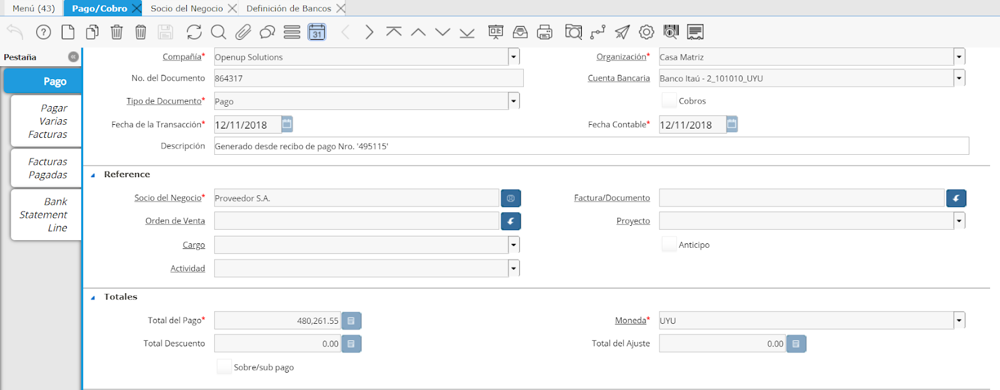
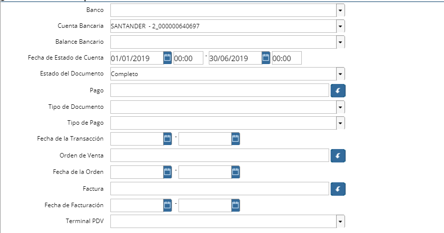

.. |Facturas Pagadas| image:: resources/bills-paid.png
.. |Bank Statement Line| image:: resources/bank-statement-line.png

.. _document/bank-transactions-traceability:

**Seguimiento de Transacciones Financieras**
============================================

En ADempiere puede fácilmente realizar un seguimiento de las transacciones financieras, tanto en la caja como en cuentas bancarias.

**Pago/Cobro (Ventana)**
------------------------

Dentro de la ventana "Pago/Cobro" se podran observar todas las transacciones financieras que sean "Contado"

En cada transacción podrá acceder a los documentos vinculados a la misma. En este caso los documentos asociados serán:

- Asignación de Pagos
- Conciliación Bancaria

|Pestaña Pago|

Imagen 1. Pestaña Pago

**Asignación de Pagos**
***********************

Un pago se podrá asignar a una o varias facturas. La asignación se podrá realizar tanto al momento de generar el pago o bien luego mediante el proceso de asignación de pagos.

A su vez, si si utiliza recibos de pago la asignación también se podrá realizar desde allí.

Podrá identificar cuando un pago está asignado en su totalidad cuando el check "Asignado" del cabezal del pago esté en "Y"

Una vez realizada la asignación se podrá indentificar la las asignaciones que tenga un pago en la pestaña de "Facturas Pagadas". Desde la pestaña se podrá ver todas las asignaciones del pago y también el importe de las mismas.

Podrá identificar cuales están completas y cuáles anuladas mediante el ^ en el número de asignación.

|Facturas Pagadas|

Imagen 2. Pestaña Facturas Pagadas

**Pago Conciliado**
*******************

Los pagos una vez conciliados se les definirá el check de "Conciliado" existente en el cabezal del pago en "Y". Una vez dicho pago esté conciliado se podrá observar la línea de la conciliación donde el mismo fue conciliado en la pestaña "Línea de Conciliación".

|Bank Statement Line|

Imagen 3. Pestaña Línea de Conciliación

**Reporte de Estado de Cuenta Bancario**
----------------------------------------

|Reporte de Estado de Cuenta Bancario|

Imagen 4. Reporte de Estado de Cuenta Bancario

**Banco:** Seleccione Banco
**Cuenta Bancaria:** Seleccione Cuenta Bancaria
**Balance Bancario:**  Conciliación Bancaria
**Fecha de Estado de Cuenta:**
**Estado del Documento:**
**Pago:**
**Tipo de Documento:**
**Fecha de Transacción:**

El reporte de estado de cuenta bancario, presentará todas las líneas que se encuentren en una conciliación, mostrando todos los documentos vinculadas a ellas (Socio del Negocio, Pagos, Facturas o Cargos Bancarios).

